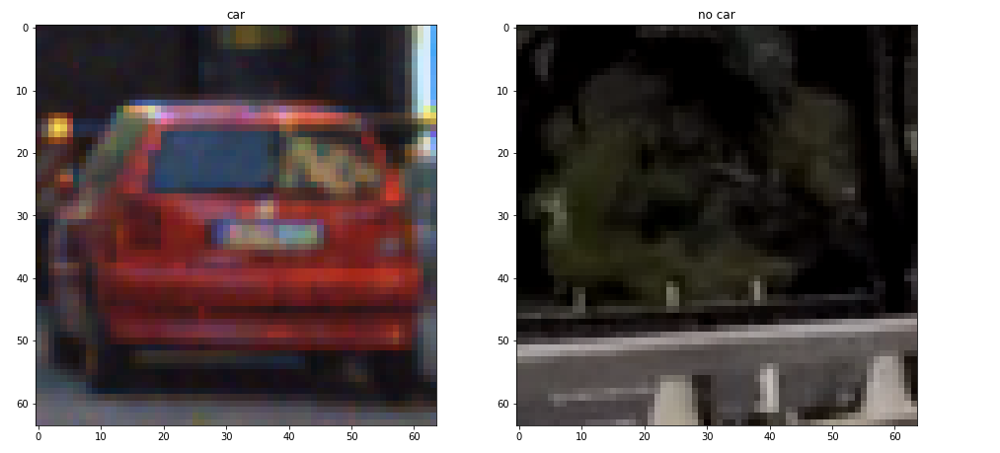
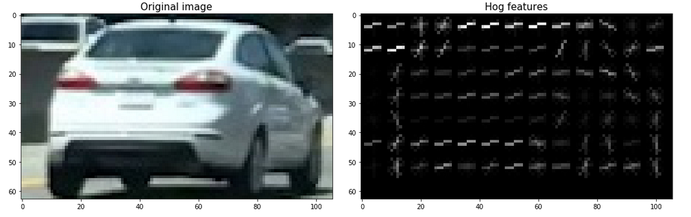
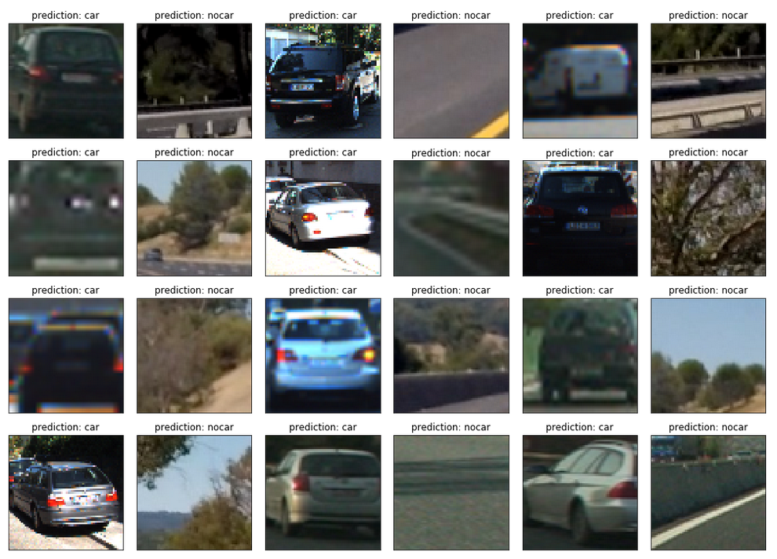
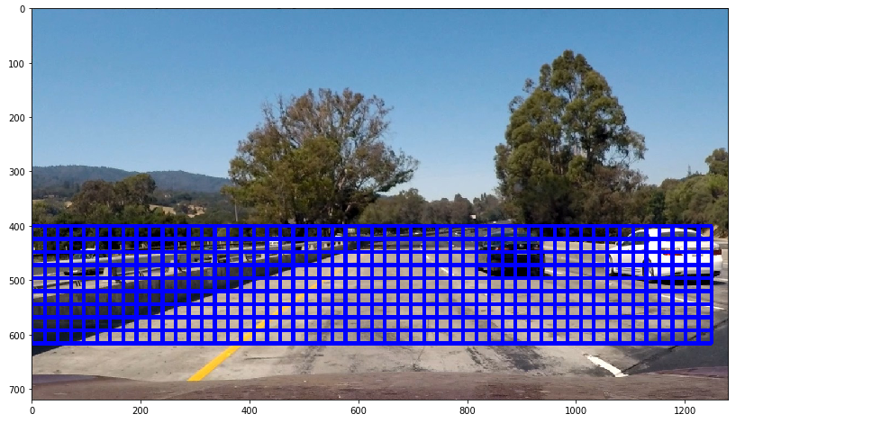
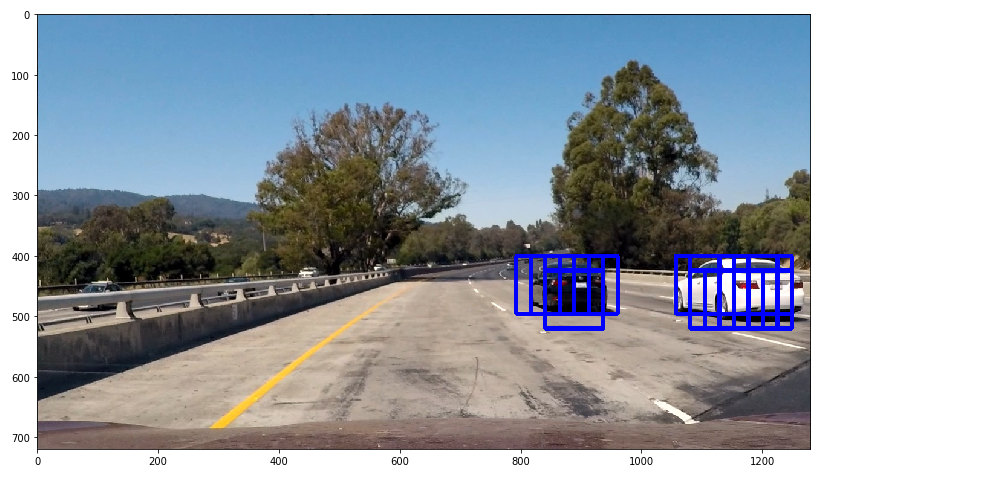
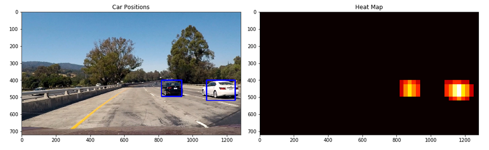
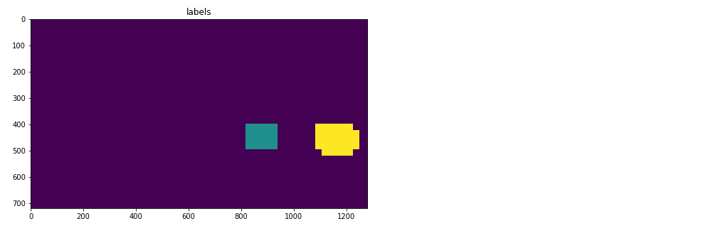

# README (Vehicle Detection Project)

The task of this project is to find cars within images and videos. Therefore different features must be extracted from images. These features are used to train a SVM to detect cars and "non-cars" in images. A sliding window technique is then used to find cars within an image. After that false positives must be rejected. Most code is taken from class and adapted if necessary.

## 1a. Histogram of Oriented Gradients (HOG)

The code for this step is contained in the section "Function for extracting HOG features" of the IPython notebook.  
I started by reading in all the `vehicle` and `non-vehicle` images.

The following pictures show examples of a `vehicle` and a `non-vehicle` class:



I then explored different color spaces and different `skimage.hog()` parameters (`orientations`, `pixels_per_cell`, and `cells_per_block`). With the following parameters I was able to get good results:

```
color_space = 'YCrCb' # Can be RGB, HSV, LUV, HLS, YUV, YCrCb
orient = 9  # HOG orientations
pix_per_cell = 8 # HOG pixels per cell
cell_per_block = 2 # HOG cells per block
```

Here is an example using the `YCrCb` color space and given HOG parameters:



## 1b. Training of SVM classifier

The code for this step is contained in the section "Loading of training data and fitting of SVM" of the IPython notebook.  

I trained the classified by loading all cars and non-cars images from the provided dataset. This gives 8460 samples of each class. I then tried different combinations of features combinations and ended up with the following result:

```
hog_feat = True # HOG features on or off
hog_channel = 'ALL' # Can be 0, 1, 2, or "ALL"

spatial_feat = True # Spatial features on or off
spatial_size = (32, 32) # Spatial binning dimensions

hist_feat = True # Histogram features on or off
hist_bins = 32    # Number of histogram bins
```

Which means that hog features from all three color channels in (YCrCb) are combined with histogram features and spatial features. The code for extracting these additional features can be found in the notebook. I chose the parameters `spatial_size` and `hist_bins` based on experience from the lecture.

The function `extract_features` extract and combines all features, so that after normalization using a `StandardScaler` a linear Support Vector Classifier (SVC) can be trained using `LinearSVC.fit`.
Also, I split training and test data so I can calculate the accuracy. I end up with an accuracy of 99.2%.
The following images show predictions for several test images:



## 2a. Sliding Window Search

The code for this step is contained in the section "Sliding window search" of the IPython notebook. The function `find_cars` implements a sliding window technique using hog sub-sampling.

Since cars are only expected on the road only, all sky pixels are removed. Also, pixels belonging to the hood are ignored. This leaves a range of 400 to 656 px in the y-direction.
The following image shows all possible search windows:



Using a `cells_per_step = 2` results in a search window overlap of 75%.
It's possible to run this same function multiple times for different scale values to generate multiple-scaled search windows. In my case, this was not necessary and running the function once
with a window of 64x64 px and a scaling factor of 1.5 gave good results.

## 2b. Pipeline and detection of false positives

The code for this step is contained in the section "Detecting false positives / heat map" of the IPython notebook.

The final pipeline can be found in the function `process_image`.
For the final pipeline, I search for cars on one scales using YCrCb 3-channel HOG features plus spatially binned color and histograms of color in the feature vector, which provided good results. From the following image it can be seen that a car is detected multiple times:



I used heat map technique to group these detections and also reduce the detection of false positives. The following image shows the heat map, which is calculated by adding +1 within the boundaries of single detections, and the final bounding box calculated by labeling (separating) detections from the heat map and thresholding them:



Labeling seperates different regions of the heat map. The results of `scipy.ndimage.measurements.label()` are shown here as well (different colors means different labels):




# 3. Video Implementation

The code for this step is contained in the section "Video" of the IPython notebook.
The final video can be found here: [link to video result](./project_video.mp4)
For the video, I applied two different strategies

* First I calculate an average heat map from the heat maps of the three last frames, this gives higher robustness over time, since a wrong detection in one frame will be compensated

* Second, I implemented a class `Vehicle` that keeps track of one single vehicle. Inside the class, the history of previous detections is kept. I then implemented a method `get_bbox_smooth` that returns a smooth bounding box calculate from the last 5 frames. This gives a smoother result. 

A comparision of using a average heatmap and using no average heatmap can be found here:
* [without averaged heat map](./test_video_output_false_positives.mp4)
* [with averaged heat map](./test_video_output_no_false_positives.mp4)

Using no average heat map leads to the detection of false positives. (In order to exaggerate the effect I reduced the heat map threshold from 1.5 to 0.8)


```python
from IPython.display import HTML
HTML("""<video width="960" height="540" controls><source src="{0}"></video>""".format('test_video_output.mp4'))
```


<video width="960" height="540" controls><source src="test_video_output.mp4"></video>


```python
from IPython.display import HTML
HTML("""
<video width="480" height="270" controls><source src="{0}">
</video><video width="480" height="270" controls><source src="{1}"></video>
""".format('test_video_output_false_positives.mp4','test_video_output_no_false_positives.mp4'))
```


<video width="480" height="270" controls><source src="test_video_output_false_positives.mp4">
</video><video width="480" height="270" controls><source src="test_video_output_no_false_positives.mp4"></video>


# Discussion

The pipeline shows good results, nonetheless, it could be improved. Especially when a car is not seen or can't be detected for a certain number of consecutive frames the current pipeline will fail. It would be possible to calculate a confidence value based on the number of successful detections in the past. Once the confidence is high enough the position of the car could be estimated based on its speed and direction.
